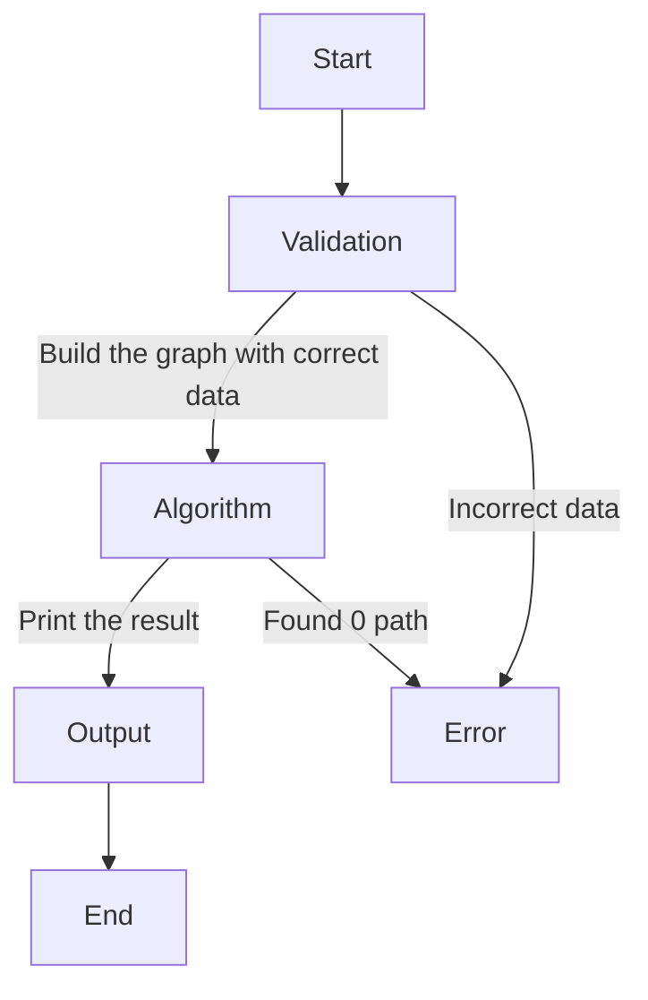

# Lem_in

# Flowchart (Planning)

```mermaid
  graph TD;
      Start-->Validation;
      Validation-->|Build the graph with correct data |Algorithm;
      Algorithm-->|Print the result|Output
      Output-->End
      Validation-->|Incorrect data|Error;
      Algorithm-->|Found 0 path|Error
```
